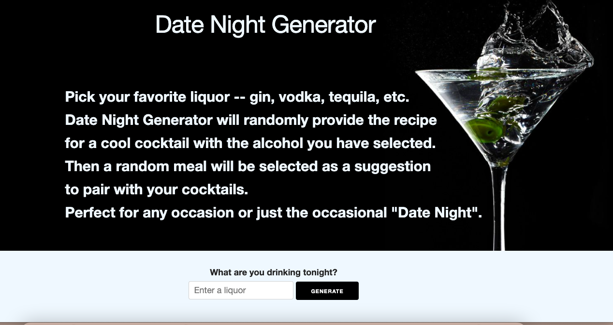
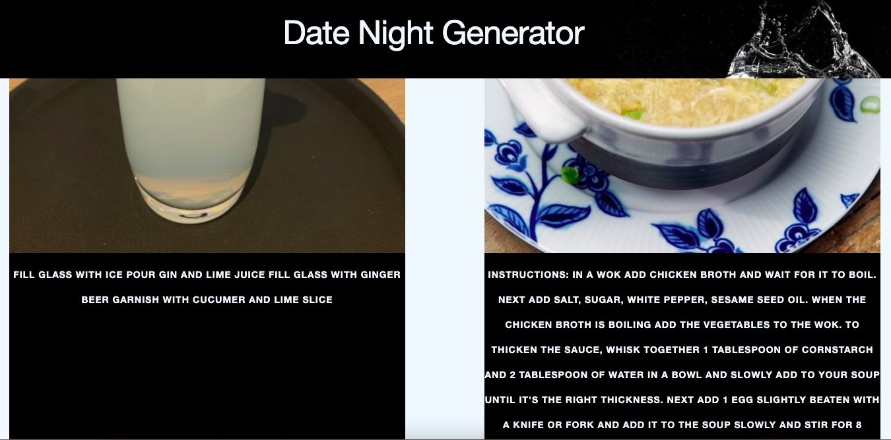

# Cocktail_Finder

Created by: [Jordan Yanev](https://github.com/jyanev01), [Elizabeth Odell](https://github.com/elizabethodell), & [Aili Chatfield-Taylor](https://github.com/ailict)

## Background
Date Night Generator is an application with a searchable base of liquors that will generate a cocktail idea based on user input; upon search, it will also return randomized meal recipe, to give users ideas for their at-home dinner dates.  

Motivation to create Date Night Generator was based on the everyday problem most of us face at dinner time to think of creating a meal. While recognizing plenty of recipe sites exist to serve recipe searchability, we realized there was a niche market opportunity to tackle both what to eat AND drink, especially when most date night diners yearn to create something outside of the norm. Searchable drink database allows the user to more accurately pinpoint a beverage based on a liquor they already own, while the randomized recipe keeps options fun and interesting. 

## Technologies Used:

HTML,

Javascript,

Skeleton CSS Framework,

TheMealDB API,

TheCocktailDB API 

## Links

[Link to github repository](https://github.com/jyanev01/Cocktail_Finder)

[Link to deployed application](https://jyanev01.github.io/Cocktail_Finder/)

[Link to class presentation](https://docs.google.com/presentation/d/1p68AiGmVcEqbAGgg3e8p6IZrfnZvDJHxR5sicG-vH5w/edit?usp=sharing)

## Images:

